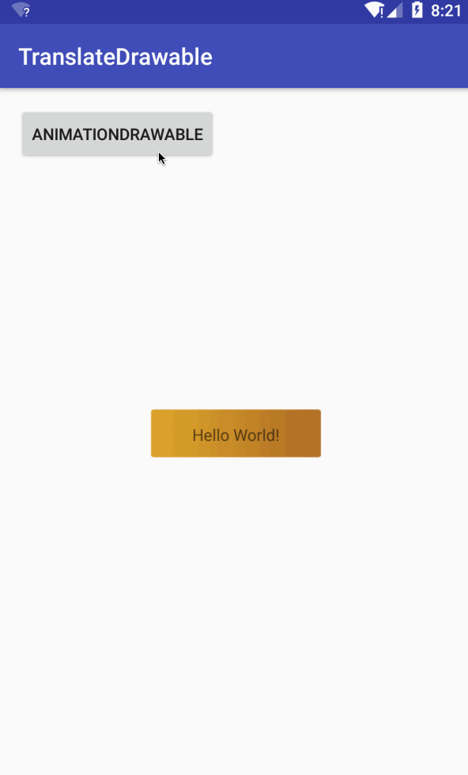

# TranslateDrawable
参考RotateDrawable和ScaleDrawable以及AnimationDrawable和LayerDrawable实现的一个Drawable，从名字不难知道这个一个可平移的drawable。

TranslateDrawable与AnimationDrawable效果类似。但AnimationDrawable由图片序列构成，而TranslateDrawable对单张图片进行平移实现动画效果，对比效果如下：

TranslateDrawable仅使用一张图片

