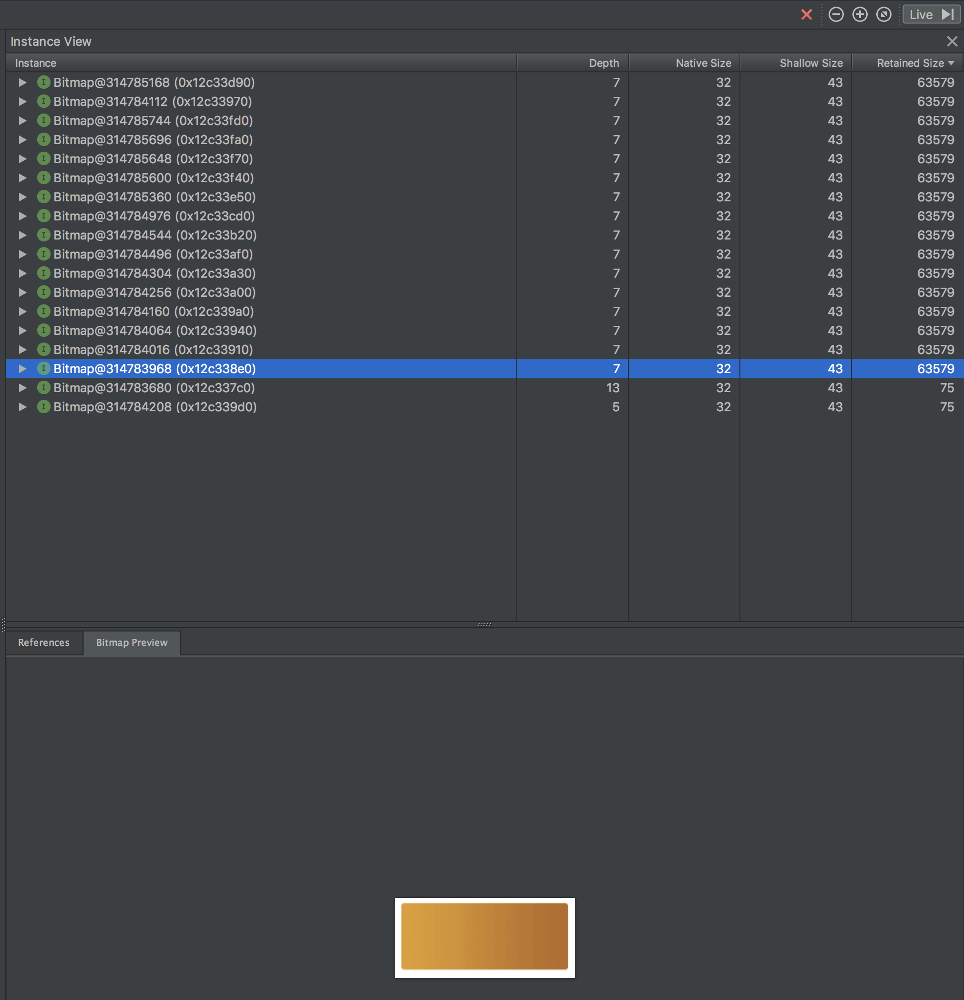
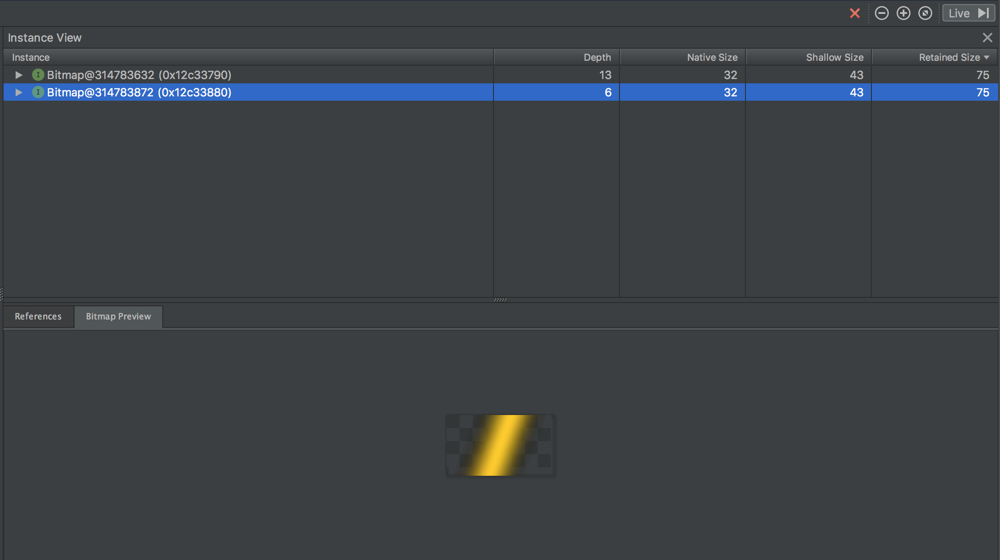
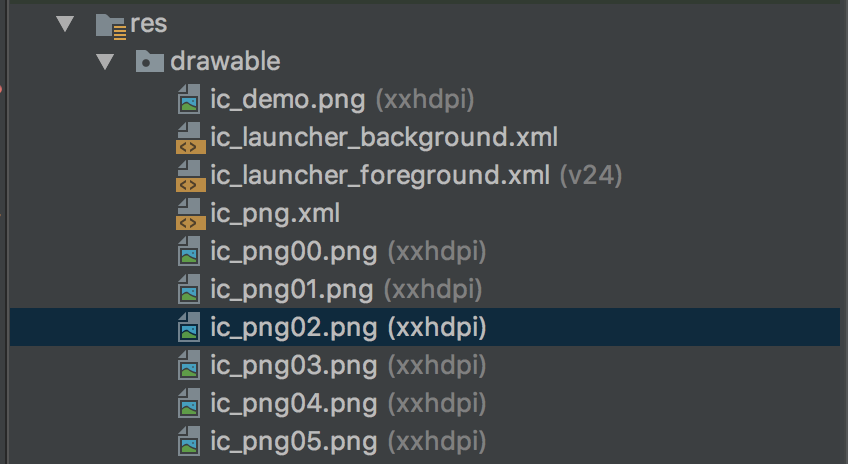
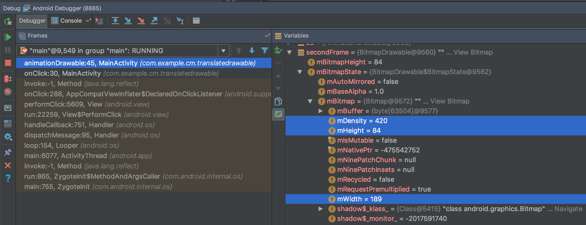
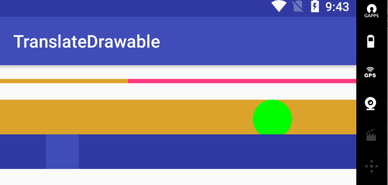

# TranslateDrawable
TransalteDrawable是一个可平移的drawable，它的实现参考了以下几个类

+ RotateDrawable和ScaleDrawable，分别是旋转和缩放的drawable
+ AnimationDrawable，动画效果的drawable
+ LayerDrawable，叠加效果的drawable

基于TranslateDrawable，很容易实现类似AnimationDrawable效果的drawable。区别在于

+ AnimationDrawable以逐帧播放图片的方式实现动画效果
+ TranslateDrawable对单张图片进行平移实现动画效果

下图对比二者的动画效果


其中，TranslateDrawable仅使用如下图片


在上述霓虹灯动画效果这类特定场景可使用TranslateDrawable，它对比AnimationDrawable的优势在于：

+ 使用更少的图片资源，减少APK大小
+ 占用更少的内存


具体到上面的这个demo，对比数据如下：

+ TranslateDrawalbe只需要两张PNG图片，AnimationDrawable使用16张PNG图片
+ TranslateDrawable比AnimationDrawable占用的内存少0.9MB左右

# 内存分析
分别dump出两种场景下的内存占用(gc后待app内存稳定时通过Android Profiler中Dump Java heap功能导出heap)。

+ 场景一 - 切换到"AnimationDrawable", 内存稳定在12.1MB左右
+ 场景二 - 切换到"TranslateDrawable", 内存稳定在11.2MB左右

场景一和场景二中约0.9MB的内存差值是如何产生的呢？下面展开分析。

我们的demo非常简单，两种场景区别仅仅在于TranslateDrawable和AnimationDrawable生成的Bitmap数据不同。从heap中找到Bitmap(bitmap占用内存最多，其他对象占用几乎可以忽略，所以这里只关注bitmap)





从heap可以看到：

+ TranslateDrawable共产生2个较小的Bitmap
+ AnimationDrawable共产生18个Bitmap，其中有16个大小为63579B的Bitmap

63579*16/1024=993KB=0.97MB，这个值非常接近我们前面看到的内存差值。可以认为这16个大小为63579B的Bitmap是导致场景一内存占用更多。

**TranslateDrawable相对AnimationDrawable的优势在于生成更少的Bitmap，明显能节省内存。**

## 为什么是63579

AnimationDrawable一共使用了16张PNG图片，图片放在xxhdpi目录，每张大小是216x96像素。



以每个像素占4个字节计算，216x96x4=82944，所以一个Bitmap对象占用的内存大小应该是82944B。但为什么我们在heap中观察到的Bitmap大小是63579呢？

Bitmap中一个像素到底占几个字节？回答这个问题，我们要了解的类包括BitmapFactory.Options和Bitmap.Config。

```java
    public static class Options {
        /**
         * If this is non-null, the decoder will try to decode into this
         * internal configuration. If it is null, or the request cannot be met,
         * the decoder will try to pick the best matching config based on the
         * system's screen depth, and characteristics of the original image such
         * as if it has per-pixel alpha (requiring a config that also does).
         *
         * Image are loaded with the {@link Bitmap.Config#ARGB_8888} config by
         * default.
         */
        public Bitmap.Config inPreferredConfig = Bitmap.Config.ARGB_8888;
    }

    /**
     * Possible bitmap configurations. A bitmap configuration describes
     * how pixels are stored. This affects the quality (color depth) as
     * well as the ability to display transparent/translucent colors.
     */
    public enum Config {
        /**
         * Each pixel is stored on 4 bytes. Each channel (RGB and alpha
         * for translucency) is stored with 8 bits of precision (256
         * possible values.)
         *
         * This configuration is very flexible and offers the best
         * quality. It should be used whenever possible.
         */
        ARGB_8888   (5),
    }
```

BitmapDrawable调用`BitmapFactory.decodeResourceStream()`生成Bitmap，该方法使用缺省的Options实例。缺省的Options实例的`inPreferredConfig`是ARGB_8888。**所以毫无疑问就我们这里的分析而言，生成的Bitmap对象一个像素占4个字节。**

**注意**，BitmapFactory.Options的文档中关于`inDensity`提到非常重要的一点，如下：

>  如果`inScaled`为`true`(缺省就是true)，并且`inDensity`跟`inTargetDensity`不一致，解码出来的Bitmap会被缩放以适应目标像素密度(target density)

```java
    public static class Options {
        /**
         * Create a default Options object, which if left unchanged will give
         * the same result from the decoder as if null were passed.
         */
        public Options() {
            inScaled = true;
            inPremultiplied = true;
        }

        /**
         * The pixel density to use for the bitmap.  This will always result
         * in the returned bitmap having a density set for it (see
         * {@link Bitmap#setDensity(int) Bitmap.setDensity(int)}).  In addition,
         * if {@link #inScaled} is set (which it is by default} and this
         * density does not match {@link #inTargetDensity}, then the bitmap
         * will be scaled to the target density before being returned.
         * /
        public int inDensity;

        /**
         * The pixel density of the destination this bitmap will be drawn to.
         * This is used in conjunction with {@link #inDensity} and
         * {@link #inScaled} to determine if and how to scale the bitmap before
         * returning it.
         * /
        public int inTargetDensity;

        /**
         * When this flag is set, if {@link #inDensity} and
         * {@link #inTargetDensity} are not 0, the
         * bitmap will be scaled to match {@link #inTargetDensity} when loaded,
         * rather than relying on the graphics system scaling it each time it
         * is drawn to a Canvas.
         *
         * <p>BitmapRegionDecoder ignores this flag, and will not scale output
         * based on density. (though {@link #inSampleSize} is supported)</p>
         *
         * <p>This flag is turned on by default and should be turned off if you need
         * a non-scaled version of the bitmap.  Nine-patch bitmaps ignore this
         * flag and are always scaled.
         *
         * <p>If {@link #inPremultiplied} is set to false, and the image has alpha,
         * setting this flag to true may result in incorrect colors.
         */
        public boolean inScaled;
    }
```

我用于测试的设备屏幕密度是420dp (getResources().getDisplayMetrics().densityDpi)，所以Options实例的几个关键参数值如下：

```java
    public static class Options {
        // 480dp, 图片放在xxhdpi目录下，对应的屏幕像素密度是480dp，见DisplayMetrics.DENSITY_XXHIGH
        public int inDensity;

        // 420dp，不是跟xxhdpi完全吻合的标准的像素密度
        public int inTargetDensity;

        // true，BitmapDrawable调用BitmapFactory.decodeResourceStream()解码Bitmap时使用的isScaled为true
        public boolean inScaled;

    }
}
```

`inDensity`和`inTargetDensity`不一致，所以生成的Bitmap会被缩放以适应目标像素密度。粗略计算如下：

216*420/480=189

96*420/480=84

放在xxhdpi目录下尺寸为216x96像素解码出来的Bitmap尺寸变成了189x84，占用的内存大小为189x84x4=63504。

debug观察Bitmap的width和height，可以看到果然是189x84



注意：计算出来的63504跟heap中观察到的63579还是有些不符。原因在于前者只是存放图片像素数据所占用的内存大小，而后者是Bitmap对象的retained memory。

# 问题
## 为什么不用动画来实现

除了AnimationDrawable和TranslateDrawable，使用动画也可以实现我们所需要的效果。

布局如下：

```xml
<LinearLayout>
<!-- 黄色背景的button -->
<Button />
<!-- 前景图片 -->
<ImageView android:src="@drawable/ic_demo" />
</LinearLayout>
```

使用`ViewPropertyAnimator`控制ImageView的位置即可。

这种方案优点是可以更精确的控制动画效果，但布局和代码复杂，不像TranslateDrawable可以简单自然地封装和复用。

TranslateDrawable效果演示



## 能否减少AnimationDrawable使用的PNG数量

demo中AnimationDrawable使用了16张PNG图片，其占用内存的数量跟图片数量是相关的。是否可以减少图片数量以降低资源和内存占用？

+ 尝试将16张减少到8张，每张图片的duration仍然为100ms，动画效果尚可接受，但动画速度过快
+ 尝试将16张减少到8张，每张图片的duration为200ms，动画速度降低了，但动画显得不连贯
+ 尝试将16张减少到4张，动画效果非常差

为了让AnimationDrawable达到较好的动画效果，需要*适当数量的图片*。
<!--

先来看一组常量。`DisplayMetrics`定义了标准的屏幕密度。

```java
public class DisplayMetrics {
    /**
     * Standard quantized DPI for low-density screens.
     */
    public static final int DENSITY_LOW = 120;

    /**
     * Standard quantized DPI for medium-density screens.
     */
    public static final int DENSITY_MEDIUM = 160;

    /**
     * Standard quantized DPI for high-density screens.
     */
    public static final int DENSITY_HIGH = 240;

    /**
     * Intermediate density for screens that sit somewhere between
     * {@link #DENSITY_XHIGH} (320 dpi) and {@link #DENSITY_XXHIGH} (480 dpi).
     * This is not a density that applications should target, instead relying
     * on the system to scale their {@link #DENSITY_XXHIGH} assets for them.
     */
    public static final int DENSITY_420 = 420;

    /**
     * Standard quantized DPI for extra-extra-high-density screens.
     */
    public static final int DENSITY_XXHIGH = 480;
```

我的模拟器上`resources.displayMetrics.density`返回420，即当前屏幕密度是420dp。

图片放在xxhdpi目录中，xxhdpi默认对应的屏幕密度是480dp，跟当前屏幕密度并不一致。所以系统必须进行恰当的缩放处理。如何处理呢？

先看一段关键代码：

```
// Bitmap.java
    public int mDensity = getDefaultDensity();

    public int getScaledWidth(int targetDensity) {
        return scaleFromDensity(getWidth(), mDensity, targetDensity);
    }

    /**
     * Convenience method that returns the height of this bitmap divided
     * by the density scale factor.
     *
     * @param targetDensity The density of the target canvas of the bitmap.
     * @return The scaled height of this bitmap, according to the density scale factor.
     */
    public int getScaledHeight(int targetDensity) {
        return scaleFromDensity(getHeight(), mDensity, targetDensity);
    }

    /**
     * @hide
     */
    static public int scaleFromDensity(int size, int sdensity, int tdensity) {
        if (sdensity == DENSITY_NONE || tdensity == DENSITY_NONE || sdensity == tdensity) {
            return size;
        }

        // Scale by tdensity / sdensity, rounding up.
        return ((size * tdensity) + (sdensity >> 1)) / sdensity;
    }
```
对我们216*96像素的图片而言，处理过程如下：

scaleFromDensity(216, 480, 420)
scaleFromDensity(96, 480, 420)

至此，我们自己手动算一下缩放后的图片大小吧

```
Python 2.7.10 (default, Oct  6 2017, 22:29:07)
[GCC 4.2.1 Compatible Apple LLVM 9.0.0 (clang-900.0.31)] on darwin
Type "help", "copyright", "credits" or "license" for more information.
>>> ((216 * 420) + (480 >> 1)) / 480
189
>>> ((96 * 420) + (480 >> 1)) / 480
84
```


63579是怎么来的呢？

216*96*4

屏幕密度 2.3

189*84像素


```java
// BitmapDrawable.java
    private void computeBitmapSize() {
        final Bitmap bitmap = mBitmapState.mBitmap;
        if (bitmap != null) {
            mBitmapWidth = bitmap.getScaledWidth(mTargetDensity);
            mBitmapHeight = bitmap.getScaledHeight(mTargetDensity);
        } else {
            mBitmapWidth = mBitmapHeight = -1;
        }
    }


```


*4/3*2.3=63590

-->
